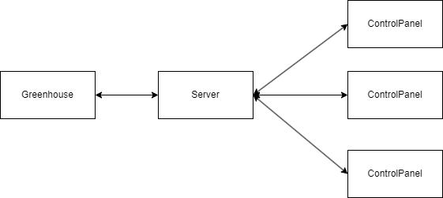

# Communication protocol

This document describes the protocol used for communication between the server and different nodes of the
distributed application.

## Terminology

* Sensor - a device which senses the environment and describes it with a value (an integer value in
  the context of this project). Examples: temperature sensor, humidity sensor.
* Actuator - a device which can influence the environment. Examples: a fan, a window opener/closer,
  door opener/closer, heater.
* Sensor and actuator node - a computer which has direct access to a set of sensors, a set of
  actuators. 
* Greenhouse node - a device in the greenhouse that is connected to the sensor actuator nodes and the internet.
* Greenhouse server - a main server that all client nodes connect to, bot control-panel nodes and the greenhouse node.
* Control-panel node - a device connected to the Internet which visualizes status of sensor and
  actuator nodes and sends control commands to them.
* Graphical User Interface (GUI) - A graphical interface where users of the system can interact with
  it.

## The underlying transport protocol

### Transport-layer protocol
We decided use TCP as our transport-layer protocol.
The reason behind this is that a tcp socket connection allows for connection-oriented communication.
This means that we can ensure that all messages are received in the correct order,
and that no messages are lost.
The main advantage of using UDP is transmission speed, but since we are not sending large
amounts of data, but this is not needed in our case.

### Port number
We chose to use port 8765 for our server. This port is in the registered ports range (1024-49151), 
and from our research it is not used by any other common services. 
Therefore, it is good choice for our server.

## The architecture

### Components
The architecture of our network consists of a greenhouse, a server and one or many control panels.
Both the greenhouse and the control panels are clients of the server.

#### Greenhouse
There is a single greenhouse, which contains a number of sensor and actuator nodes.

#### Control panel
There can be multiple control panels, which are used to control the actuators on the sensor nodes,
as well as to display the sensor data.

#### Server
There is a single server, which is used to connect the greenhouse and the control panels. It uses
a combination of unicast and broadcast messages to allow for communication between the nodes.

### Robustness
These components are structured in such a way that connections can be established and terminated in
any order any amount of times. This makes the application robust to network failures and
all possible user actions.

The greenhouseNodes holds multiple sensorActuatorNodes, so at the end of the day many control-panels can talk to many sensorActuatorNodes

## The flow of information and events

### Server
Once the server starts, it will open a TCP socket on the decided port and wait for clients to
connect.
When a client connects, the server will see what type of client it is (a Greenhouse or Control Panel).
The server stores one instance of the greenhouse and a list of all connected control panels. These
are updated as clients connect and disconnect. A new thread is also created to manage each active
client.

The server will then send the client an unencrypted message, which contains a random symmetric key
unique for this connection. The client will then encrypt all future messages using this key. The
encryption is tested by having the client send an encrypted message 'OK' to the server,
which the server decrypts. If the server receives 'OK', the encryption is successful, otherwise
the connection is terminated.

From now on, for as long as the connection is open, the server will listen for messages from the
client. If the client is the greenhouse, the server will multicast the message to all connected
control panels. If the client is a control panel, the server will unicast the message to the
greenhouse.

### Greenhouse
Once the Greenhouse starts it will attempt to connect to the server. If the server is offline, or
for some reason the connection fails, the greenhouse will keep trying to connect until it
succeeds.

Once a TCP connection is established, the greenhouse will let the server know what type of client
it is. The server will then send a single unencrypted message with a symmetric key.
The greenhouse will then encrypt all future messages using this key.

From this point on, the greenhouse will periodically send sensor data to the server.
The greenhouse also listens for messages from the server, which can be actuator commands. It will
then change the state of the actuator accordingly.

Control panel:
Control panels are started up individualy and automatically connects to the server. The get updates periodically from the server which they display in a GUI

### Control panel
In similar fashion to the greenhouse, once a control panel starts it will attempt to connect to the
server.
If the server is offline, or for some reason the connection fails, the control panel will keep
trying to connect until it succeeds.

Once a TCP connection is established, the control panel will let the server know what type of client
it is. The server will then send a single unencrypted message with a symmetric key.
The control panel will then encrypt all future messages using this key.

From this point on, the control panel will listen for messages from the server, which can be sensor
data or actuator updates. The control panel will then display this data to the user. When the user
changes the state of an actuator, the control panel will send the actuator update to the server.

## Connection and state

We use a stateless connection-oriented approach. This allows us to get two way communication from and to both control panels and the greenhouse node from the server.

## Types, constants

A common value type we use across many of our messages is the nodeId. This informs the recieving party for which node to update the information display of or to change.

## Message format

Every message contains a commandword at the start, this tells the receiver what it should do and if it should send data as a response. 

Commands supported by control-panel
add NodeId ActuatorId ActuatorType ActuatorState ... (ActuatorInformation is repeated as many times as there are actuators on the node)
remove NodeId
updateSensorsInformation NodeId <reading...>
updateActuatorInformation NodeId ActuatorId ActuatorState

Commands supported by greenhouse node
setupNodes
startDataTransfer
get NodeId
set NodeId ActuatorId ActuatorState
add sensor NodeId SensorType Sensor MinValue MaxValue IntitialValue Unit
add actuator NodeId ActuatorId ActuatorType

Commands supported by Server
I am Controlpanel -> Special command used in handshake
I am Greenhouse -> Special command used in handshake

### Error messages

In our system nodes do not send error messages over the network. If a node encounters an error, 
it will attempt to reconnect to the server if possible. If a non-connection-oriented error occurs,
such as in parsing of a message, the error gets logged for debugging purposes.

## An example scenario

TODO - describe a typical scenario. How would it look like from communication perspective? When 
are connections established? Which packets are sent? How do nodes react on the packets? An 
example scenario could be as follows:
1. A sensor node with ID=1 is started. It has a temperature sensor, two humidity sensors. It can also open a window.
2. A sensor node with ID=2 is started. It has a single temperature sensor and can control two fans and a heater.
3. A control panel node is started.
4. Another control panel node is started.
5. A sensor node with ID=3 is started. It has a two temperature sensors and no actuators.
6. After 5 seconds all three sensor/actuator nodes broadcast their sensor data.
7. The user of the first-control panel presses on the button "ON" for the first fan of sensor/actuator node with ID=2.
8. The user of the second control-panel node presses on the button "turn off all actuators".

Server Starts
1. Server opens port 8765 and waits for clients to connect.

Connection of greenhouseNode
1. GreenhouseNode requests to connect to serverSocket on greenhouseServer (Port 8765)
2. GreenhouseNode sends a handshake request saying "I am Greenhouse"
3. Server then sets the connected socket as the greenhouse (All future control commands are sent through this socket)

Connection of control panel
1. control panel request to connecto to serverSocket greenhouseServer (Port 8765)
2. control panel sends a handshake request saying "I am controlPanel"
3. Server sets connection as a controlpanel (All updates from the greenhouse will be sent through this socket)
4. Server sends initial information about available nodes.

Control panel requests an actuator to open or close
1. Message gets sent from control panel to the server containing the nodeId and actuatorId of the actuator to be changed and the wanted state.
2. When message gets recieved on the server it gets sent along to the greenhouse
3. The greenhouse then changes the state of the actuator 

Actuator changes on a sensorActuatorNode
1. The greenhouseNode sends an update message to the server that the actuator state was changed
2. This state change then gets sent along to all connected control panels so that all states get synced up with the new state

## Reliability and security

### Reliablitiy
Package reliability comes from TCP reliability, we also have functionality to reconnect the sockets if they at any point loose connection.

### Security
Packages are encrypted with symmetric keys so that they cannot be read by a unwanted third party (Man in the middle attack).
